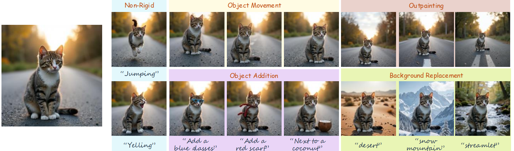

<div align="center">

<h1>FreeFlux: Understanding and Exploiting Layer-Specific Roles in RoPE-Based MMDiT for Versatile Image Editing (ICCV2025)</h1>
<a href="https://arxiv.org/abs/2503.16153"></a>
<a href="https://wtybest.github.io/projects/FreeFlux/"></a>

**[Tianyi Wei](https://scholar.google.com/citations?user=-wfXmM4AAAAJ&hl=en) &emsp; [Yifan Zhou](https://zhouyifan.net/) &emsp; [Dongdong Chen](https://www.dongdongchen.bid/) &emsp; [Xingang Pan](https://xingangpan.github.io)**

S-lab, Nanyang Technological University;  Microsoft GenAI

> This repository hosts the official PyTorch implementation of the paper: "**FreeFlux: Understanding and Exploiting Layer-Specific Roles in RoPE-Based MMDiT for Versatile Image Editing**".



**Leveraging the layer-specific roles in RoPE-based MMDiT we discovered, versatile training-free image editing is tailored to different task characteristics, including non-rigid editing, object addition, background replacement, object movement, and outpainting.**
</div>

## Getting Started
### Prerequisites
```bash
$ conda create -n freeflux python=3.10
$ pip install torch==2.5.1+cu121 torchvision==0.20.1+cu121 --index-url https://download.pytorch.org/whl/cu121
$ pip install diffusers==0.31.0 transformers==4.46.2
$ pip install matplotlib jupyter ipykernel opencv-python scipy sentencepiece protobuf accelerate
$ git clone https://github.com/facebookresearch/sam2.git && cd sam2
$ pip install -e .
```

### Probing
```bash
$ cd probing
$ python3 gen_rope_probing_dataset.py
$ python3 positional_dependency_eval.py
```
To probe the layer-wise positional dependency in FLUX, navigate to the `probing` directory and first run `gen_rope_probing_dataset.py` to generate the probing dataset. Then, execute `positional_dependency_eval.py` to evaluate the dependency levels across different layers.


### Enjoy
```bash
$ cd editing
```
To start the editing experience for a specific task, simply open the `.ipynb` file located in the directory corresponding to the task name.

If you run it on a remote server, you need to run `jupyter notebook --port=20367 --allow-root --ip=0.0.0.0` first. then use e.g. VS Code to select that Jupyter Server as your kernel.

## Citation

If you find our work useful for your research, please consider citing the following papers :)

```
@article{wei2025freeflux,
  title={FreeFlux: Understanding and Exploiting Layer-Specific Roles in RoPE-Based MMDiT for Versatile Image Editing},
  author={Wei, Tianyi and Zhou, Yifan and Chen, Dongdong and Pan, Xingang},
  journal={Proceedings of the IEEE/CVF International Conference on Computer Vision},
  year={2025}
}
```


